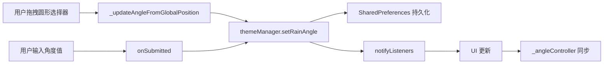

# 设置界面实现

> 雨幕设置界面和交互式方向选择器的完整实现

## 📋 概述

雨幕设置界面提供了用户友好的配置选项：

1. **雨滴开关** - `SwitchListTile` 控制雨滴显示/隐藏
2. **方向选择器** - 圆形交互式角度选择器
3. **角度输入** - 文本框直接输入角度值
4. **实时预览** - 配置变更立即生效

## 🎨 界面布局

```
┌─────────────────────────────────┐
│  💧 雨滴效果                     │
│  ─────────────────────────────  │
│  [●] 显示雨滴动画                │
│      雨滴效果已开启               │
│                                 │
│  雨滴方向                        │
│  调整雨滴下落的角度               │
│                                 │
│  ┌─────┐  角度值                │
│  │  ↗  │  ┌──────────────┐     │
│  │  ●  │  │ 145°         │     │
│  └─────┘  └──────────────┘     │
│  圆形选择器  文本输入框           │
└─────────────────────────────────┘
```

## 1️⃣ RainTab 组件

### 组件定义

```dart
class RainTab extends StatefulWidget {
  final ThemeManager themeManager;
  
  const RainTab({
    super.key,
    required this.themeManager,
  });
  
  @override
  State<RainTab> createState() => _RainTabState();
}
```

### 状态管理

```dart
class _RainTabState extends State<RainTab> {
  final TextEditingController _angleController = TextEditingController();
  final GlobalKey _directionPickerKey = GlobalKey();
  
  @override
  void initState() {
    super.initState();
    // 初始化角度输入框
    _angleController.text = widget.themeManager.rainAngle.round().toString();
    // 监听主题变化
    widget.themeManager.addListener(_onThemeChanged);
  }
  
  @override
  void dispose() {
    widget.themeManager.removeListener(_onThemeChanged);
    _angleController.dispose();
    super.dispose();
  }
  
  void _onThemeChanged() {
    // 同步角度值到输入框
    _angleController.text = widget.themeManager.rainAngle.round().toString();
  }
}
```

**关键设计**：
- `TextEditingController` 管理角度输入框
- `GlobalKey` 用于获取方向选择器的位置信息
- 监听 `ThemeManager` 实现双向绑定

### 主布局

```dart
@override
Widget build(BuildContext context) {
  return ListView(
    padding: const EdgeInsets.all(16),
    children: [
      Card(
        child: Padding(
          padding: const EdgeInsets.all(20),
          child: ListenableBuilder(
            listenable: widget.themeManager,
            builder: (context, _) => Column(
              crossAxisAlignment: CrossAxisAlignment.start,
              children: [
                // 标题
                Row(
                  children: [
                    Icon(Icons.water_outlined, 
                         color: Theme.of(context).colorScheme.primary),
                    const SizedBox(width: 12),
                    Text('雨滴效果', 
                         style: Theme.of(context).textTheme.titleLarge),
                  ],
                ),
                const SizedBox(height: 16),
                
                // 雨滴开关
                _buildRainToggle(context),
                
                // 方向控制（仅在开启时显示）
                if (widget.themeManager.showRain) ...[
                  const SizedBox(height: 20),
                  _buildRainAngleControl(context),
                ],
              ],
            ),
          ),
        ),
      ),
    ],
  );
}
```

**布局特点**：
- 使用 `ListenableBuilder` 监听主题变化
- 条件渲染：雨滴关闭时隐藏方向控制
- `Card` 包裹提供视觉分组

## 2️⃣ 雨滴开关

### 实现代码

```dart
Widget _buildRainToggle(BuildContext context) {
  return SwitchListTile(
    value: widget.themeManager.showRain,
    onChanged: (value) => widget.themeManager.setShowRain(value),
    title: const Text('显示雨滴动画', style: TextStyle(fontSize: 14)),
    subtitle: Text(
      widget.themeManager.showRain ? '雨滴效果已开启' : '雨滴效果已关闭',
      style: const TextStyle(fontSize: 12),
    ),
    contentPadding: EdgeInsets.zero,
    visualDensity: VisualDensity.compact,
    secondary: Icon(
      widget.themeManager.showRain
          ? Icons.water_drop
          : Icons.water_drop_outlined,
      size: 20,
      color: widget.themeManager.showRain
          ? Theme.of(context).colorScheme.primary
          : Theme.of(context).colorScheme.outline,
    ),
  );
}
```

**交互逻辑**：
- 开关状态绑定到 `themeManager.showRain`
- 变更时调用 `setShowRain()` 自动持久化
- 图标和文字根据状态动态变化

## 3️⃣ 方向控制区域

### 布局结构

```dart
Widget _buildRainAngleControl(BuildContext context) {
  return Column(
    crossAxisAlignment: CrossAxisAlignment.start,
    children: [
      Text('雨滴方向', style: Theme.of(context).textTheme.titleMedium),
      const SizedBox(height: 8),
      Text(
        '调整雨滴下落的角度',
        style: Theme.of(context).textTheme.bodyMedium?.copyWith(
          color: Theme.of(context).colorScheme.onSurfaceVariant,
        ),
      ),
      const SizedBox(height: 24),
      Row(
        children: [
          _buildDirectionPicker(context),  // 圆形选择器
          const SizedBox(width: 24),
          Expanded(child: _buildAngleInput(context)),  // 文本输入
        ],
      ),
    ],
  );
}
```

## 4️⃣ 圆形方向选择器

### 容器设计

```dart
Widget _buildDirectionPicker(BuildContext context) {
  return Container(
    key: _directionPickerKey,  // 用于坐标转换
    width: 120,
    height: 120,
    decoration: BoxDecoration(
      shape: BoxShape.circle,
      border: Border.all(
        color: Theme.of(context).colorScheme.outline,
        width: 2,
      ),
      gradient: RadialGradient(
        colors: [
          Theme.of(context).colorScheme.surfaceContainerHighest,
          Theme.of(context).colorScheme.surface,
        ],
        radius: 0.8,
      ),
    ),
    child: ListenableBuilder(
      listenable: widget.themeManager,
      builder: (context, _) {
        final angle = widget.themeManager.rainAngle;
        return GestureDetector(
          behavior: HitTestBehavior.opaque,
          onPanStart: (details) => 
              _updateAngleFromGlobalPosition(details.globalPosition),
          onPanUpdate: (details) => 
              _updateAngleFromGlobalPosition(details.globalPosition),
          child: CustomPaint(
            painter: _DirectionPainter(
              angle: angle,
              color: Theme.of(context).colorScheme.primary,
            ),
          ),
        );
      },
    ),
  );
}
```

**视觉设计**：
- 圆形容器（120x120）
- 径向渐变背景
- 边框突出可交互区域

**交互设计**：
- `onPanStart` 和 `onPanUpdate` 捕获拖拽
- `HitTestBehavior.opaque` 确保整个区域可点击
- 实时更新角度

### 角度计算逻辑

```dart
void _updateAngleFromGlobalPosition(Offset globalPosition) {
  // 1. 获取选择器的 RenderBox
  final renderBox = _directionPickerKey.currentContext?.findRenderObject() 
      as RenderBox?;
  if (renderBox == null) return;
  
  // 2. 转换全局坐标到局部坐标
  final localPosition = renderBox.globalToLocal(globalPosition);
  
  // 3. 计算圆心
  final center = Offset(
    renderBox.size.width / 2, 
    renderBox.size.height / 2
  );
  
  // 4. 计算相对于圆心的偏移
  final dx = localPosition.dx - center.dx;
  final dy = localPosition.dy - center.dy;
  
  // 5. 计算角度（atan2 返回 -π 到 π）
  var newAngle = math.atan2(dy, dx) * 180 / math.pi + 90;
  
  // 6. 归一化到 0-360 范围
  if (newAngle < 0) newAngle += 360;
  if (newAngle > 360) newAngle -= 360;
  
  // 7. 更新主题管理器和输入框
  widget.themeManager.setRainAngle(newAngle);
  _angleController.text = newAngle.round().toString();
}
```

**坐标转换流程**：
```
全局坐标 → 局部坐标 → 相对圆心坐标 → 角度（弧度） → 角度（度数）
```

**角度映射**：
```
        0° (向下)
           |
270° ------●------ 90° (向右)
           |
        180° (向上)
```

## 5️⃣ _DirectionPainter 绘制器

### 绘制逻辑

```dart
class _DirectionPainter extends CustomPainter {
  final double angle;
  final Color color;
  
  _DirectionPainter({required this.angle, required this.color});
  
  @override
  void paint(Canvas canvas, Size size) {
    final center = Offset(size.width / 2, size.height / 2);
    final radius = size.width / 2 - 10;
    
    // 1. 绘制中心点
    final centerPaint = Paint()
      ..color = color
      ..style = PaintingStyle.fill;
    canvas.drawCircle(center, 6, centerPaint);
    
    // 2. 计算箭头终点
    final radians = (angle - 90) * math.pi / 180;
    final arrowEnd = Offset(
      center.dx + radius * 0.8 * math.cos(radians),
      center.dy + radius * 0.8 * math.sin(radians),
    );
    
    // 3. 绘制指示线
    final linePaint = Paint()
      ..color = color
      ..style = PaintingStyle.stroke
      ..strokeWidth = 3
      ..strokeCap = StrokeCap.round;
    canvas.drawLine(center, arrowEnd, linePaint);
    
    // 4. 绘制箭头
    final arrowPaint = Paint()
      ..color = color
      ..style = PaintingStyle.fill;
    
    final arrowHeadAngle = math.pi / 6;  // 30度
    final arrowHeadLength = 16;
    
    final p1 = Offset(
      arrowEnd.dx - arrowHeadLength * math.cos(radians - arrowHeadAngle),
      arrowEnd.dy - arrowHeadLength * math.sin(radians - arrowHeadAngle),
    );
    final p2 = Offset(
      arrowEnd.dx - arrowHeadLength * math.cos(radians + arrowHeadAngle),
      arrowEnd.dy - arrowHeadLength * math.sin(radians + arrowHeadAngle),
    );
    
    final path = Path()
      ..moveTo(arrowEnd.dx, arrowEnd.dy)
      ..lineTo(p1.dx, p1.dy)
      ..lineTo(p2.dx, p2.dy)
      ..close();
    
    canvas.drawPath(path, arrowPaint);
  }
  
  @override
  bool shouldRepaint(_DirectionPainter oldDelegate) {
    return oldDelegate.angle != angle || oldDelegate.color != color;
  }
}
```

**绘制元素**：
1. **中心点** - 6px 圆形，表示旋转中心
2. **指示线** - 从中心到箭头的直线
3. **箭头** - 三角形，指向雨滴下落方向

**箭头绘制算法**：
```
        arrowEnd (箭头尖端)
           /\
          /  \
         /    \
        p1    p2
```

## 6️⃣ 角度文本输入

### 实现代码

```dart
Widget _buildAngleInput(BuildContext context) {
  return Column(
    crossAxisAlignment: CrossAxisAlignment.start,
    children: [
      const Text('角度值', style: TextStyle(fontWeight: FontWeight.w500)),
      const SizedBox(height: 8),
      TextField(
        controller: _angleController,
        keyboardType: const TextInputType.numberWithOptions(
          signed: true,
          decimal: false,
        ),
        decoration: const InputDecoration(
          border: OutlineInputBorder(),
          labelText: '角度 (-360 ~ 360)',
          suffixText: '°',
        ),
        onSubmitted: (value) {
          final angle = double.tryParse(value);
          if (angle != null) {
            widget.themeManager.setRainAngle(angle);
          } else {
            // 解析失败，恢复原值
            _angleController.text = 
                widget.themeManager.rainAngle.round().toString();
          }
        },
      ),
    ],
  );
}
```

**输入验证**：
- 仅允许数字输入（`numberWithOptions`）
- 支持负数（`signed: true`）
- 提交时验证并更新
- 无效输入时恢复原值

## 🔄 数据流



**双向绑定**：
- 圆形选择器 → ThemeManager → 文本输入框
- 文本输入框 → ThemeManager → 圆形选择器
- ThemeManager → RainBackground（实时预览）

## 🎨 主题适配

### 颜色使用

```dart
// 主色调
Theme.of(context).colorScheme.primary

// 边框和轮廓
Theme.of(context).colorScheme.outline

// 背景色
Theme.of(context).colorScheme.surface
Theme.of(context).colorScheme.surfaceContainerHighest

// 文字颜色
Theme.of(context).colorScheme.onSurface
Theme.of(context).colorScheme.onSurfaceVariant
```

### 深浅色模式

所有颜色自动跟随 Material Design 3 主题：
- 深色模式：自动使用深色背景和浅色文字
- 浅色模式：自动使用浅色背景和深色文字

## 💡 交互细节

### 1. 实时反馈

```dart
ListenableBuilder(
  listenable: widget.themeManager,
  builder: (context, _) {
    // 任何配置变更都会触发重建
    return CustomPaint(
      painter: _DirectionPainter(
        angle: widget.themeManager.rainAngle,
        color: Theme.of(context).colorScheme.primary,
      ),
    );
  },
)
```

### 2. 条件显示

```dart
if (widget.themeManager.showRain) ...[
  const SizedBox(height: 20),
  _buildRainAngleControl(context),
]
```

雨滴关闭时自动隐藏方向控制，减少视觉干扰。

### 3. 状态同步

```dart
void _onThemeChanged() {
  _angleController.text = widget.themeManager.rainAngle.round().toString();
}
```

确保文本输入框始终显示最新值。

## 🔍 常见问题

### Q: 圆形选择器不响应触摸？

A: 检查 `HitTestBehavior.opaque` 是否设置，确保整个区域可点击。

### Q: 角度值不同步？

A: 确保监听了 `ThemeManager` 并在 `_onThemeChanged` 中更新 `_angleController`。

### Q: 输入框接受无效值？

A: 在 `onSubmitted` 中使用 `double.tryParse()` 验证，失败时恢复原值。

### Q: 如何自定义选择器大小？

A: 修改 `Container` 的 `width` 和 `height` 属性，保持正方形以维持圆形。

## 📚 下一步

- **[配置管理](./03-configuration.md)** - 了解 ThemeManager 的实现
- **[集成指南](./04-integration-guide.md)** - 在项目中使用设置界面
- **[完整代码](./05-code-reference.md)** - 查看完整源代码

---

**相关文件**: [`lib/ui/settings/rain_tab.dart`](../../lib/ui/settings/rain_tab.dart)
