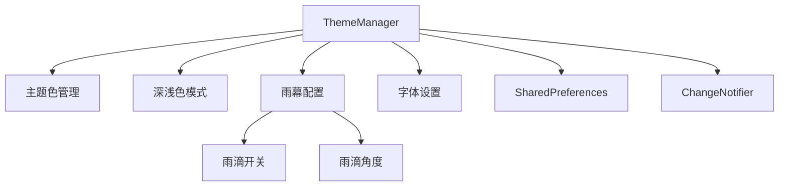

# 配置管理

> 雨幕配置的状态管理和持久化存储方案

## 📋 概述

雨幕配置管理通过 `ThemeManager` 实现，提供：

1. **状态管理** - 使用 `ChangeNotifier` 实现响应式更新
2. **持久化存储** - 使用 `SharedPreferences` 保存配置
3. **主题集成** - 雨幕配置与应用主题统一管理
4. **类型安全** - 强类型 API 和参数验证

## 🏗️ ThemeManager 架构

### 核心职责



### 类定义

```dart
class ThemeManager extends ChangeNotifier {
  // 持久化键
  static const String _rainAngleKey = 'rc_rain_angle';
  static const String _showRainKey = 'rc_show_rain';
  
  // 状态属性
  double _rainAngle = 145;
  bool _showRain = true;
  bool _initialized = false;
  
  // Getter
  double get rainAngle => _rainAngle;
  bool get showRain => _showRain;
  bool get initialized => _initialized;
}
```

## 1️⃣ 初始化流程

### init 方法

```dart
Future<void> init() async {
  final prefs = await SharedPreferences.getInstance();
  
  // 加载雨滴角度（默认 145 度）
  _rainAngle = prefs.getDouble(_rainAngleKey) ?? 145.0;
  
  // 加载雨滴开关（默认开启）
  _showRain = prefs.getBool(_showRainKey) ?? true;
  
  _initialized = true;
  notifyListeners();
}
```

**初始化时机**：
```dart
// 在 main.dart 中
void main() async {
  WidgetsFlutterBinding.ensureInitialized();
  
  final themeManager = ThemeManager();
  await themeManager.init();  // 等待初始化完成
  
  runApp(MyApp(themeManager: themeManager));
}
```

**为什么需要 initialized 标志？**
- 避免在加载完成前使用默认值
- 可以显示加载指示器
- 确保 UI 显示正确的初始状态

## 2️⃣ 雨滴角度管理

### setRainAngle 方法

```dart
/// 设置雨滴角度 (-360 到 360)
Future<void> setRainAngle(double angle) async {
  // 1. 参数验证和归一化
  final normalizedAngle = angle.clamp(-360.0, 360.0);
  
  // 2. 避免无效更新
  if (_rainAngle == normalizedAngle) return;
  
  // 3. 更新内存状态
  _rainAngle = normalizedAngle;
  notifyListeners();  // 触发 UI 更新
  
  // 4. 持久化到磁盘
  final prefs = await SharedPreferences.getInstance();
  await prefs.setDouble(_rainAngleKey, normalizedAngle);
}
```

**设计要点**：

1. **参数验证**
   ```dart
   final normalizedAngle = angle.clamp(-360.0, 360.0);
   ```
   限制角度范围，防止无效值。

2. **避免无效更新**
   ```dart
   if (_rainAngle == normalizedAngle) return;
   ```
   相同值不触发更新，减少不必要的重绘和 I/O。

3. **先更新后持久化**
   ```dart
   _rainAngle = normalizedAngle;
   notifyListeners();  // UI 立即响应
   await prefs.setDouble(...);  // 异步持久化
   ```
   UI 响应优先，持久化在后台完成。

### 使用示例

```dart
// 在 UI 中
ElevatedButton(
  onPressed: () {
    themeManager.setRainAngle(180);  // 设置为向上
  },
  child: Text('向上'),
)

// 在 Widget 中监听
ListenableBuilder(
  listenable: themeManager,
  builder: (context, _) {
    return Text('当前角度: ${themeManager.rainAngle}°');
  },
)
```

## 3️⃣ 雨滴开关管理

### setShowRain 方法

```dart
/// 切换雨滴显示
Future<void> setShowRain(bool show) async {
  // 1. 避免无效更新
  if (_showRain == show) return;
  
  // 2. 更新内存状态
  _showRain = show;
  notifyListeners();
  
  // 3. 持久化到磁盘
  final prefs = await SharedPreferences.getInstance();
  await prefs.setBool(_showRainKey, show);
}
```

### 使用示例

```dart
// 开关控件
Switch(
  value: themeManager.showRain,
  onChanged: (value) => themeManager.setShowRain(value),
)

// 条件渲染
if (themeManager.showRain)
  RainBackground(
    angle: themeManager.rainAngle,
    child: MyContent(),
  )
else
  MyContent()
```

## 4️⃣ 响应式更新

### ChangeNotifier 模式

```dart
class ThemeManager extends ChangeNotifier {
  // 任何状态变更都调用 notifyListeners()
  Future<void> setRainAngle(double angle) async {
    _rainAngle = angle;
    notifyListeners();  // 通知所有监听者
    // ...
  }
}
```

### 监听方式

#### 方式 1: ListenableBuilder（推荐）

```dart
ListenableBuilder(
  listenable: themeManager,
  builder: (context, child) {
    return RainBackground(
      showRain: themeManager.showRain,
      angle: themeManager.rainAngle,
      child: child!,
    );
  },
  child: MyStaticContent(),  // 不会重建的部分
)
```

**优点**：
- 自动管理监听器生命周期
- 支持 `child` 参数优化性能
- 类型安全

#### 方式 2: addListener / removeListener

```dart
class _MyWidgetState extends State<MyWidget> {
  @override
  void initState() {
    super.initState();
    widget.themeManager.addListener(_onThemeChanged);
  }
  
  @override
  void dispose() {
    widget.themeManager.removeListener(_onThemeChanged);
    super.dispose();
  }
  
  void _onThemeChanged() {
    setState(() {});  // 触发重建
  }
  
  @override
  Widget build(BuildContext context) {
    return Text('角度: ${widget.themeManager.rainAngle}°');
  }
}
```

**注意**：必须在 `dispose` 中移除监听器，否则内存泄漏。

#### 方式 3: AnimatedBuilder

```dart
AnimatedBuilder(
  animation: themeManager,
  builder: (context, child) {
    return RainBackground(
      showRain: themeManager.showRain,
      angle: themeManager.rainAngle,
      child: child!,
    );
  },
  child: MyStaticContent(),
)
```

**说明**：`AnimatedBuilder` 也可用于监听 `ChangeNotifier`。

## 5️⃣ 持久化存储

### SharedPreferences 使用

```dart
// 保存
final prefs = await SharedPreferences.getInstance();
await prefs.setDouble('rc_rain_angle', 145.0);
await prefs.setBool('rc_show_rain', true);

// 读取
final angle = prefs.getDouble('rc_rain_angle') ?? 145.0;
final show = prefs.getBool('rc_show_rain') ?? true;

// 删除
await prefs.remove('rc_rain_angle');

// 清空所有
await prefs.clear();
```

### 存储位置

| 平台 | 存储位置 |
|------|---------|
| Android | `SharedPreferences` (XML 文件) |
| iOS | `NSUserDefaults` |
| Windows | 注册表 |
| Linux | 配置文件 |
| Web | `localStorage` |

### 数据类型支持

```dart
// 支持的类型
prefs.setInt('count', 42);
prefs.setDouble('angle', 145.0);
prefs.setBool('enabled', true);
prefs.setString('name', 'Rain Curtain');
prefs.setStringList('tags', ['rain', 'animation']);

// 不支持的类型（需要序列化）
// prefs.setObject(...)  // ❌ 不存在
```

### 复杂对象存储

如果需要存储复杂对象，使用 JSON 序列化：

```dart
// 保存
final config = {
  'angle': 145.0,
  'showRain': true,
  'dropCount': 80,
};
await prefs.setString('rain_config', jsonEncode(config));

// 读取
final jsonStr = prefs.getString('rain_config');
if (jsonStr != null) {
  final config = jsonDecode(jsonStr);
  final angle = config['angle'] as double;
  final showRain = config['showRain'] as bool;
}
```

## 6️⃣ 完整集成示例

### 主应用入口

```dart
import 'package:flutter/material.dart';
import 'theme_manager.dart';
import 'rain_background.dart';

void main() async {
  WidgetsFlutterBinding.ensureInitialized();
  
  // 初始化主