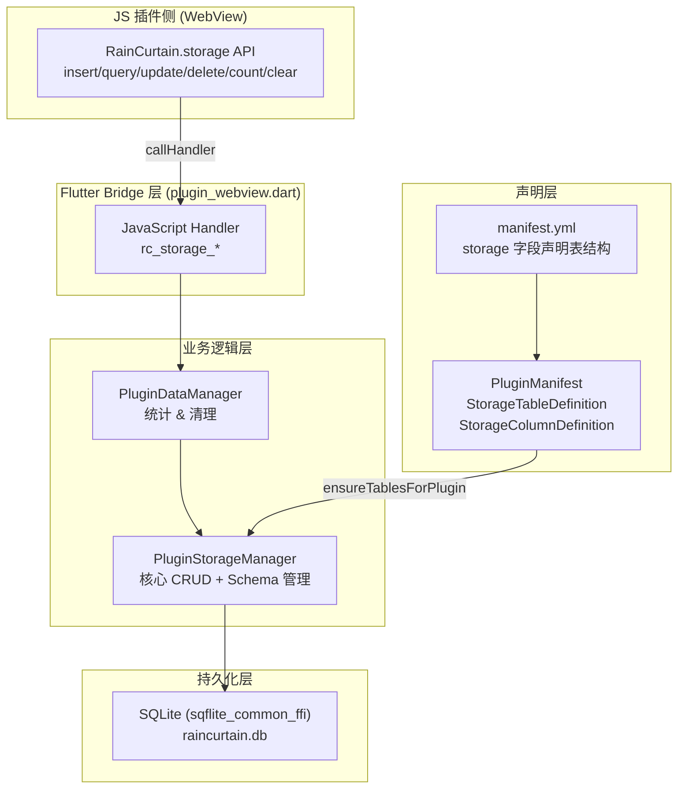
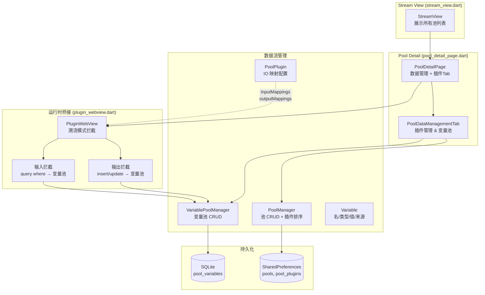
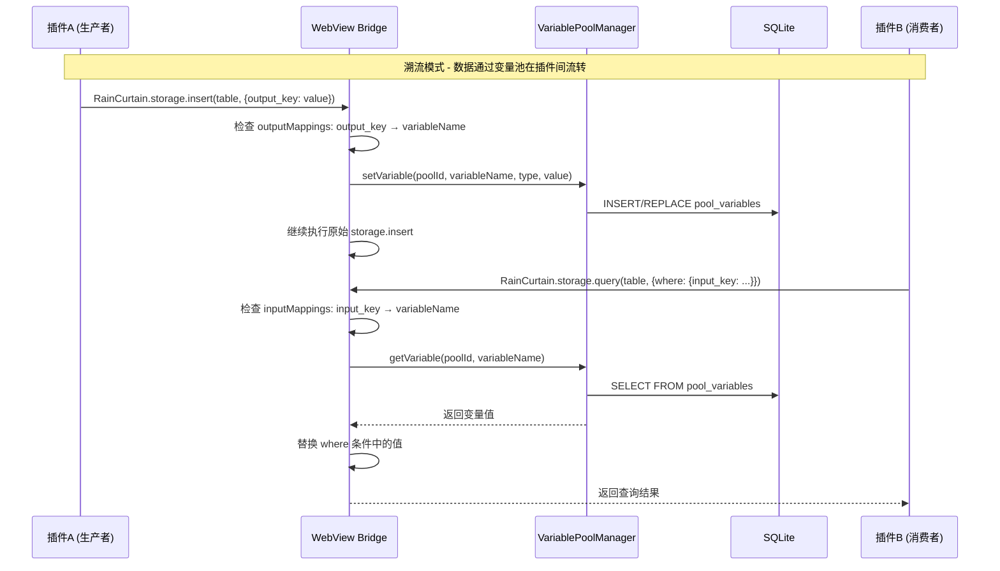
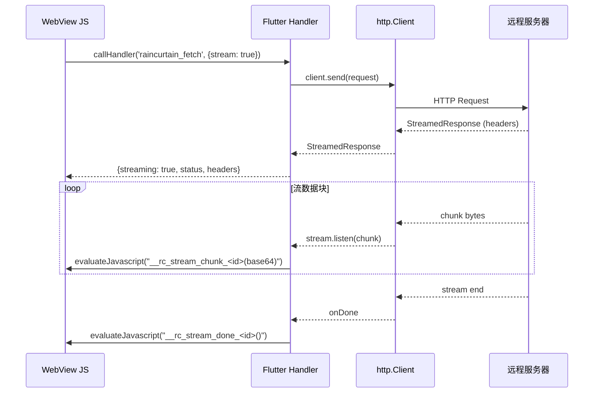

现在我已经全面阅读了项目代码，下面生成完整的审查报告。

---

# 雨幕（RainCurtain）项目审查报告

## 一、插件存储模式（Plugin Storage）

### 1. 整体架构概览

### 2. 存储模式设计详解

#### 2.1 Schema 声明式定义

- 每个插件在 `manifest.yml` 中通过 `storage` 字段声明其需要的表结构
- 支持 4 种列类型：`text`、`integer`、`real`、`boolean`
- `boolean` 在 SQLite 中映射为 `INTEGER`（0/1），读取时自动转换为 `true/false`
- 表名/列名强制正则校验：`^[a-zA-Z_][a-zA-Z0-9_]*$`
- 系统保留 `_id` 列（`INTEGER PRIMARY KEY AUTOINCREMENT`），插件无法覆盖

#### 2.2 命名空间隔离

- 数据库表名格式：`plugin_{sanitized_uuid}__{table_name}`
- UUID 中的 `-` 替换为 `_`，双下划线 `__` 作为分隔符
- 这确保了**不同插件之间的完全数据隔离**

#### 2.3 Schema 缓存与验证

- `_schemaCache: Map<String, List<StorageTableDefinition>>` 在内存中缓存 Schema
- 所有 CRUD 操作**先验证表名和列名的合法性**，防止 SQL 注入
- WHERE 子句使用**参数化查询**，不拼接用户输入
- ORDER BY 子句有独立的 `_sanitizeOrderBy` 验证

#### 2.4 表生命周期管理

- `ensureTablesForPlugin()`：幂等创建，检测 Schema 变更时**先 DROP 再 CREATE**
- `dropTablesForPlugin()`：卸载时通过 LIKE 前缀匹配清理所有相关表
- `registerSchema()`：仅缓存不建表，用于 handler 验证

### 3. 插件存储模式优点

| 优点             | 说明                                                 |
| ---------------- | ---------------------------------------------------- |
| ✅ 强隔离        | 每个插件的表有唯一命名前缀，物理隔离                 |
| ✅ 声明式 Schema | 在 manifest.yml 声明，启动时自动建表                 |
| ✅ SQL 注入防护  | 参数化查询 + 列名/表名白名单验证                     |
| ✅ 事务支持      | insert 使用 `_db.transaction` + `batch`          |
| ✅ 类型安全      | boolean 自动在 Dart/JS/SQLite 间转换                 |
| ✅ 宽松查询模式  | query 在无 Schema 缓存时降级为直接查询（用于设置页） |

### 4. 插件存储模式问题与风险

#### 🔴 严重问题

**P1: Schema 变更导致数据丢失**

- `ensureTablesForPlugin()` 第 96-103 行：当检测到列不匹配时，直接 `DROP TABLE` 再重建
- 这意味着**任何列的增加/删除/重命名都会丢失全部数据**
- 没有任何数据迁移机制，也没有用户确认
- **建议**：实现 `ALTER TABLE ADD COLUMN` 增量迁移；或至少在 DROP 前导出数据/提示用户

**P2: 表名拼接存在潜在注入风险**

- `dbTableName()` 和 `_dbTablePrefix()` 虽然对 UUID 做了 sanitize（替换 `-` 为 `_`），但最终表名是通过字符串拼接插入 SQL 的
- 第 100 行 `DROP TABLE IF EXISTS $fullName`、第 111 行 `CREATE TABLE IF NOT EXISTS $fullName` 等处都是直接拼接
- 虽然 UUID 来源可控（由系统生成），但 `tableName` 来自 manifest.yml（用户提供），正则校验 `^[a-zA-Z_][a-zA-Z0-9_]*$` 是防线
- **风险等级**：中等。正则已经过滤了特殊字符，但建议对拼接后的完整表名再做一次验证

**P3: `query()` 宽松模式的 SQL 注入风险**

- 第 220-250 行：当 Schema 缓存不存在时，`where` 参数的键名未经验证直接拼入 SQL
- `clauses.add('${entry.key} = ?');` — `entry.key` 来自外部，可能包含恶意 SQL
- `orderBy` 在宽松模式下也未经验证（第 242 行 `sql += ' ORDER BY $orderBy'`）
- **建议**：宽松模式也应对 key 和 orderBy 做正则验证

#### 🟡 中等问题

**P4: PluginDataManager 与 PluginStorageManager 存在双重实例化**

- `PluginManager` 和 `PluginDataManager` 各自独立创建了 `PluginStorageManager` 实例
- `PluginManager._init()` 第 77 行：`_storageManager = PluginStorageManager(database: _db)`
- `PluginDataManager._init()` 第 38 行：`pluginStorageManager = PluginStorageManager(database: db)`
- 两个实例的 `_schemaCache` 不共享，可能导致一个实例认为表有效而另一个不认为
- **建议**：统一为单例或通过 DI 注入同一实例

**P5: `getStorageSize()` 近似计算不准确**

- 使用 `SUM(LENGTH(column))` 计算存储大小，忽略了 SQLite 索引、页开销、NULL 值等
- 对用户展示可能造成误导
- **建议**：标注为"近似值"或使用 `PRAGMA page_count * PRAGMA page_size` 获取更准确的数据库大小

**P6: `_restoreUuid()` UUID 格式假设过强**

- 严格要求 8-4-4-4-12 分段，如果未来使用非标准 UUID 将无法还原
- 目前项目使用 UUID v7，符合标准，但缺少容错

#### 🟢 轻微问题

**P7: 缺少批量操作优化**

- `getStorageSize()` 和 `getStorageItemCount()` 对每个表逐一查询，N 个表需要 N 次查询
- 可以合并为一次查询

---

## 二、Stream 模式（溯流模式 / Pool System）

### 1. 整体架构概览

### 2. Stream 模式数据流

### 3. 核心机制分析

#### 3.1 池（Pool）与池插件（PoolPlugin）

- **Pool**：容器概念，有唯一 UUID v7 ID、名称、时间戳
- **PoolPlugin**：池内的插件实例，包含：
  - `pluginId`：引用的全局插件 ID
  - `order`：排序序号（支持拖拽排序）
  - `inputMappings: Map<String, String>`：输入映射（`{inputName: variableName}`）
  - `outputMappings: Map<String, String>`：输出映射（`{outputName: variableName}`）

#### 3.2 变量池（VariablePoolManager）

- 每个 Pool 有独立的变量空间
- 变量有 `name`、`type`、`value`、`sourcePluginId`、`updatedAt`
- 内存缓存 + SQLite 持久化的双层架构
- 懒加载：首次访问某 Pool 时才从 DB 加载

#### 3.3 IO 拦截机制

- **输出拦截**（insert/update 时）：当插件写入的数据键匹配 `outputMappings` 时，自动将值写入变量池
- **输入拦截**（query 时）：当查询条件的键匹配 `inputMappings` 时，自动从变量池读取值替换
- 插件本身**无感知**，不需要知道自己运行在溯流模式

### 4. Stream 模式优点

| 优点          | 说明                                        |
| ------------- | ------------------------------------------- |
| ✅ 插件无感知 | 插件不需要修改代码，IO 映射完全透明         |
| ✅ 松耦合     | 插件间通过变量池间接通信，无直接依赖        |
| ✅ 可配置     | IO 映射在 UI 中可视化配置                   |
| ✅ 来源追踪   | 变量记录 `sourcePluginId`，可追溯数据来源 |
| ✅ 持久化保障 | 变量池使用 SQLite，重启不丢失               |

### 5. Stream 模式问题与风险

#### 🔴 严重问题

**P8: Pool/PoolPlugin 使用 SharedPreferences 存储，缺乏事务保障**

- `PoolManager._savePools()` 和 `_savePoolPlugins()` 使用 SharedPreferences
- 而 `VariablePoolManager` 使用 SQLite
- **混用两种存储引擎**，无法保证一致性（如：池创建成功但插件配置丢失）
- SharedPreferences 在 Windows 上的可靠性不如 SQLite
- **建议**：将 Pool 和 PoolPlugin 数据也迁移到 SQLite，与变量池使用同一事务

**P9: 输出拦截在写入变量池时不阻塞原始操作**

- `plugin_webview.dart` 第 1514-1535 行：输出拦截是在 `storage.insert` handler 中先执行的
- 但如果 `setVariable` 失败（异常被吞），原始 insert 仍会继续
- 这可能导致**数据不一致**：存储中有数据但变量池没有同步
- **建议**：增加错误传播机制或至少记录日志

**P10: 输入拦截仅对 `where` 条件生效，覆盖面不足**

- 输入拦截只替换 `query` 的 `where` 参数（第 1574-1585 行）
- 如果插件直接用固定值查询（不通过 where），则无法拦截
- 输入拦截不影响 `insert`、`update`、`delete` 操作的参数
- 这限制了数据流转的灵活性

#### 🟡 中等问题

**P11: 同一插件可多次添加到同一池，缺少去重**

- `PoolManager.addPluginToPool()` 没有检查插件是否已存在于池中
- 虽然每个 PoolPlugin 有独立的 ID，但这可能不是用户预期行为
- **建议**：至少提示用户，或支持同一插件多实例的场景说明

**P12: 变量池缺少类型校验**

- `VariablePoolManager.setVariable()` 接受任意 `type` 和 `value`
- 类型由 `_inferType()` 推断，可能不一致
- 消费者插件获取变量时无类型校验
- **建议**：在 setVariable 时校验 value 与 type 是否匹配

**P13: 拖拽排序后未刷新 WebView**

- `reorderPlugins()` 更新了顺序但 `PoolDetailPage` 的 TabController 可能未同步重建
- 用户可能看到错位的标签

**P14: 变量池的懒加载可能导致首次读取延迟**

- `_loadPoolVariables()` 在首次 `getVariable` 时才触发 DB 查询
- 如果变量池很大，可能造成输入拦截延迟
- **建议**：在 PoolDetailPage 进入时预加载（已有 `ensureLoaded()`，但仅在 DataManagementTab 调用）

#### 🟢 轻微问题

**P15: `_inferType()` 推断逻辑过于简单**

- 无法区分 `int` 和 `double`（都归为 `number`）
- `null` 默认推断为 `string`，可能不准确

**P16: 变量池没有大小限制**

- 没有对单个池的变量数量或总大小做限制
- 长时间运行可能导致内存和存储膨胀

---

## 三、网络请求 Stream（Fetch Stream 模式）

### 1. 架构说明

### 2. Fetch Stream 优点

| 优点                 | 说明                                             |
| -------------------- | ------------------------------------------------ |
| ✅ 支持 SSE          | 通过 `Accept: text/event-stream` 自动启用流式  |
| ✅ 请求取消          | 支持 AbortController / AbortSignal               |
| ✅ 标准 Response API | JS 侧构建 ReadableStream，兼容标准 fetch API     |
| ✅ LRU 缓存          | GET 请求支持 50 条 LRU 缓存，遵循 Cache-Control  |
| ✅ 性能监控          | `_FetchMetrics` 记录每个请求的时间、大小、状态 |

### 3. Fetch Stream 问题与风险

#### 🔴 严重问题

**P17: 流式数据通过 `evaluateJavascript` 推送，存在转义漏洞**

- 第 1891-1892 行：`final b64 = base64Encode(chunk);` 然后直接拼入 JS 字符串
- Base64 编码本身是安全的（只含 `A-Za-z0-9+/=`），但如果编码实现出错或 chunk 为空，可能产生问题
- 更重要的是 `onError` 中的错误消息（第 1907 行）只做了简单的 `replaceAll('"', '\\"').replaceAll('\n', '\\n')` 转义
- 这**不足以防止 JS 注入**（如包含 `');` 等字符）
- **建议**：使用 `jsonEncode()` 对错误消息进行完整转义

**P18: 流式响应未在 Widget dispose 时正确取消**

- `dispose()` 中关闭了 `_activeRequests` 中的 client（第 483-488 行）
- 但 `streamedResponse.stream.listen()` 的回调中检查了 `mounted`（第 1888 行），如果 `!mounted` 则不推送
- 然而**stream.listen() 本身没有被 cancel**，流数据会继续下载直到完成
- 这可能导致**内存泄漏和不必要的网络流量**
- **建议**：保存 `StreamSubscription` 引用，在 dispose 时显式 cancel

#### 🟡 中等问题

**P19: 请求缓存不区分 headers**

- `_RequestCache` 以 URL 为 key（第 110 行）
- 相同 URL 但不同 headers（如不同的 Authorization）会命中同一缓存
- **建议**：将 headers 的 hash 纳入缓存 key

**P20: XHR 拦截不支持流式响应**

- `RainCurtainXHR.prototype.send` 始终传 `stream: false`（第 1161 行）
- 只有 fetch API 支持流式，XMLHttpRequest 不支持
- 这是合理的设计决策（XHR 本身不支持流），但应在文档中说明

**P21: base64 编解码性能开销**

- 所有网络响应体都经过 base64 编码传输（Flutter→JS）
- 对于大文件或大量数据，base64 会增加约 33% 的大小
- 流式模式每个 chunk 都要编解码
- **建议**：对于大响应考虑分块传输或直接传二进制

---

## 四、总体评估

### 架构质量评分

| 维度       | 评分     | 说明                                         |
| ---------- | -------- | -------------------------------------------- |
| 代码组织   | ⭐⭐⭐⭐ | 职责分离清晰，Manager 模式合理               |
| 安全性     | ⭐⭐⭐   | 参数化查询好，但有几处拼接风险               |
| 数据一致性 | ⭐⭐⭐   | 混用 SharedPreferences 和 SQLite 是主要痛点  |
| 可扩展性   | ⭐⭐⭐⭐ | Schema 声明式设计、IO 映射机制都有良好扩展性 |
| 错误处理   | ⭐⭐⭐   | 大部分地方有 try-catch，但异常吞没较多       |
| 性能       | ⭐⭐⭐   | 有缓存和懒加载，但缺少批量优化和大小限制     |

### 优先修复建议（按严重性排序）

1. **P1**：Schema 变更数据丢失 → 实现增量迁移
2. **P8**：存储引擎混用 → 统一到 SQLite
3. **P17**：JS 注入风险 → 完善转义
4. **P18**：流式订阅未取消 → 保存并 cancel StreamSubscription
5. **P3**：宽松模式注入 → 添加列名验证
6. **P4**：双重实例化 → 统一 PluginStorageManager 实例
7. **P9**：输出拦截错误传播 → 增加错误处理
8. **P19**：缓存 key 不含 headers → 改进缓存策略
