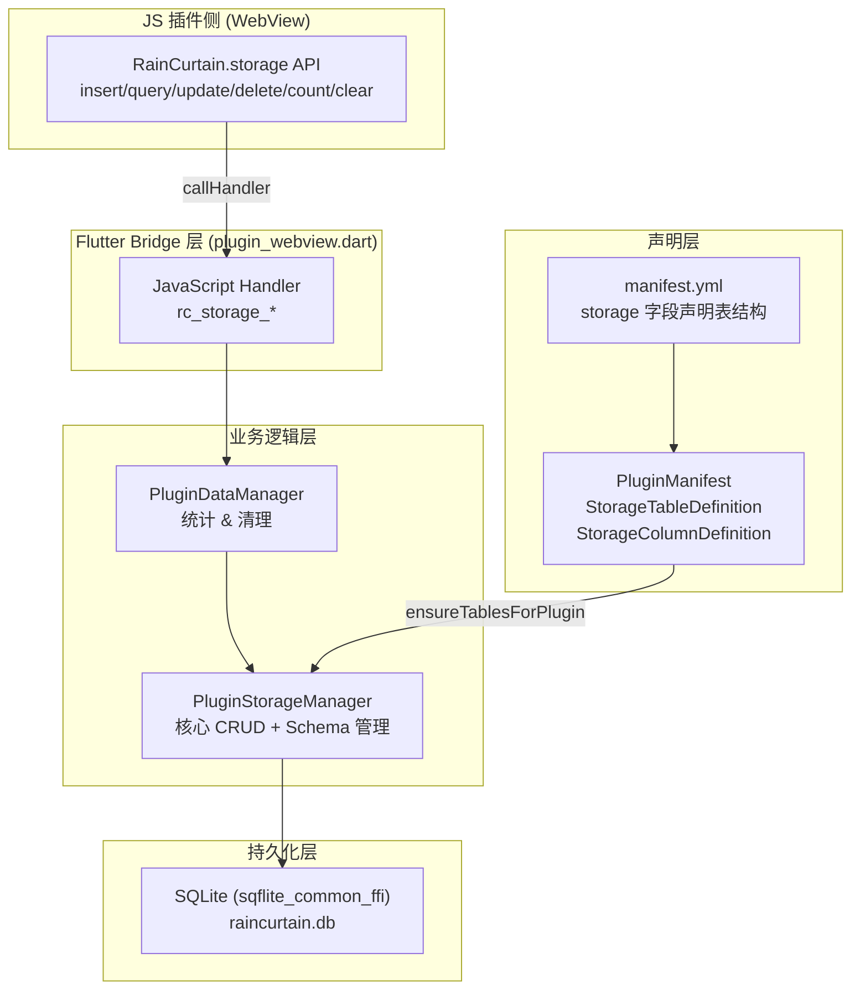
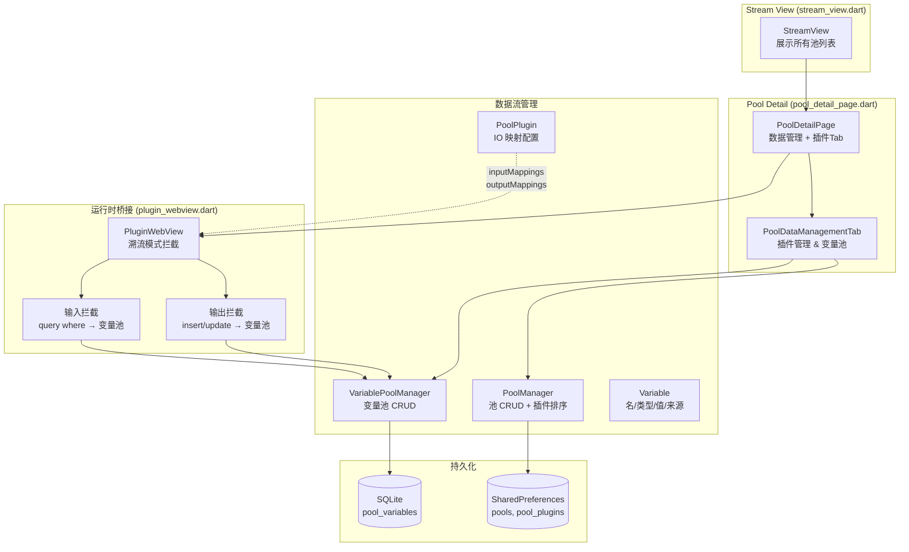
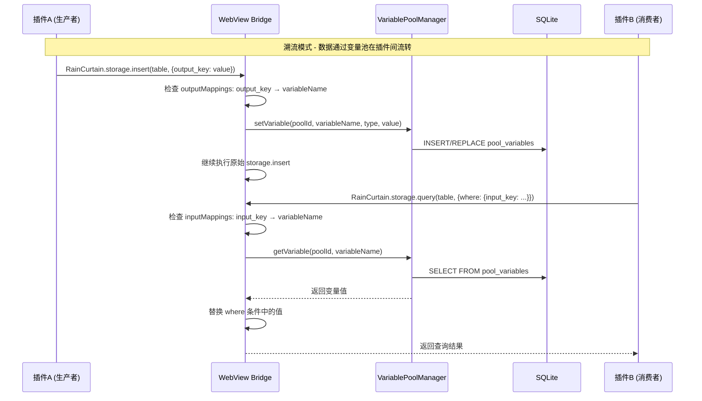
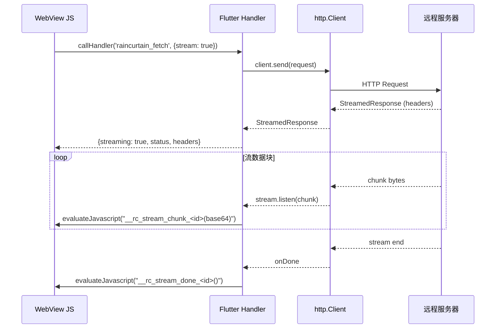

# 雨幕（RainCurtain）项目代码审查报告

> 审查标准：程序能否正常运行、逻辑是否正确。不假设极端情况，不设定极限条件。

---

## 一、插件存储模式（Plugin Storage）

### 1. 整体架构概览



### 2. 存储模式设计详解

#### 2.1 Schema 声明式定义

- 每个插件在 `manifest.yml` 中通过 `storage` 字段声明其需要的表结构
- 支持 4 种列类型：`text`、`integer`、`real`、`boolean`
- `boolean` 在 SQLite 中映射为 `INTEGER`（0/1），读取时自动转换为 `true/false`
- 表名/列名强制正则校验：`^[a-zA-Z_][a-zA-Z0-9_]*$`
- 系统保留 `_id` 列（`INTEGER PRIMARY KEY AUTOINCREMENT`），插件无法覆盖

#### 2.2 命名空间隔离

- 数据库表名格式：`plugin_{sanitized_uuid}__{table_name}`
- UUID 中的 `-` 替换为 `_`，双下划线 `__` 作为分隔符
- 不同插件之间完全数据隔离

#### 2.3 Schema 缓存与验证

- `_schemaCache` 在内存中缓存 Schema
- 所有 CRUD 操作先验证表名和列名的合法性
- WHERE 子句使用参数化查询
- ORDER BY 子句有独立的 `_sanitizeOrderBy` 验证

#### 2.4 表生命周期管理

- `ensureTablesForPlugin()`：幂等创建，检测 Schema 变更时先 DROP 再 CREATE
- `dropTablesForPlugin()`：卸载时通过 LIKE 前缀匹配清理所有相关表
- `registerSchema()`：仅缓存不建表，用于 handler 验证

### 3. 存储模式 — 确认正常的设计

| 项目             | 说明                                                 |
| ---------------- | ---------------------------------------------------- |
| 强隔离           | 每个插件的表有唯一命名前缀，物理隔离                 |
| 声明式 Schema    | 在 manifest.yml 声明，启动时自动建表                 |
| SQL 注入防护     | 参数化查询 + 列名/表名白名单验证                     |
| 事务支持         | insert 使用 `_db.transaction` + `batch`              |
| 类型安全         | boolean 自动在 Dart/JS/SQLite 间转换                 |
| 宽松查询模式     | query 在无 Schema 缓存时降级为直接查询（用于设置页） |
| 表名拼接安全     | UUID 由系统生成，tableName 经正则校验，拼接安全可控   |

### 4. 存储模式问题

#### P1: `query()` 宽松模式中 `where` 键名和 `orderBy` 未做验证

**文件**：`plugin_storage_manager.dart:227-241`

**现象**：当 Schema 缓存不存在时（宽松模式），`where` 参数的键名直接拼入 SQL：

```dart
clauses.add('${entry.key} = ?');  // entry.key 未经验证
```

`orderBy` 同样直接拼入：

```dart
sql += ' ORDER BY $orderBy';  // orderBy 未经验证
```

**影响**：宽松模式的调用方是 `PluginDataManager`（设置页查看数据），调用链为内部代码而非插件直接传入。但如果未来有新的调用路径，可能引入问题。

**建议**：对宽松模式的 `entry.key` 和 `orderBy` 也加上 `_nameRegex` 正则验证，保持和严格模式一致的防护。

#### P2: PluginStorageManager 被实例化两次，Schema 缓存不共享

**文件**：`plugin_manager.dart:77` 和 `plugin_data_manager.dart:38`

**现象**：
- `PluginManager` 创建了自己的 `_storageManager` 实例（负责安装/卸载时建表/删表）
- `PluginDataManager` 也创建了自己的 `pluginStorageManager` 实例（负责 CRUD 操作和统计）

两个实例共享同一个 `Database`，但 `_schemaCache` 各自独立。

**影响**：实际运行中，`PluginManager` 在安装插件时调用 `ensureTablesForPlugin()` 会注册 Schema 到自己的缓存中。而 `PluginDataManager` 的实例在被 WebView handler 调用 CRUD 时，由于没有注册 Schema，会走宽松模式查询。这不会导致功能异常（宽松模式可以正常查询），但会跳过列名验证和 boolean 类型转换。

查看 `plugin_webview.dart:1538-1543`，WebView handler 使用的是 `dataManager.pluginStorageManager`，即 `PluginDataManager` 的实例。如果该实例的 Schema 缓存中没有注册对应插件的 Schema，insert/update/delete/count/clear 操作会抛出 `ArgumentError`（因为 `_isValidTable` 返回 false），只有 query 可以降级。

**实际情况**：经过仔细核查，`PluginManager._loadPlugins()` 在加载插件时调用 `_storageManager.ensureTablesForPlugin()`，这只注册到 `PluginManager` 的实例。而 WebView handler 用的是 `PluginDataManager` 的实例，其 Schema 缓存为空。这意味着 **insert/update/delete/count/clear 操作在运行时会因 `_isValidTable` 检查失败而报错**。

**修复方式**：需要确保 WebView handler 使用的 `PluginStorageManager` 实例已注册了对应插件的 Schema。最直接的方法是让 `PluginDataManager` 和 `PluginManager` 共享同一个 `PluginStorageManager` 实例，或在 WebView handler 初始化时调用 `registerSchema()`。

#### P3: 流式响应的 StreamSubscription 在 Widget dispose 时未被 cancel

**文件**：`plugin_webview.dart:1886-1918`

**现象**：流式响应通过 `streamedResponse.stream.listen()` 监听数据块，回调中检查 `mounted` 来决定是否推送给 JS。但 `listen()` 返回的 `StreamSubscription` 没有被保存，`dispose()` 时只关闭了 `client`（第 483-488 行），没有显式 cancel subscription。

**影响**：当用户在流式请求进行中离开页面时，`client.close()` 会触发底层连接关闭，通常会导致 stream 抛出异常并被 `onError` 捕获，随后 `cancelOnError: true` 会自动取消订阅。所以在大多数情况下流会正确终止。但存在时序窗口：如果 dispose 和 stream chunk 到达之间存在竞态，可能会有少量无效回调执行（回调中已有 `mounted` 检查，不会实际调用 `evaluateJavascript`，所以不会崩溃）。

**建议**：将 `StreamSubscription` 保存到 `_activeRequests` 类似的集合中，在 `dispose()` 时显式 cancel，使代码意图更清晰。

---

## 二、Stream 模式（溯流模式 / Pool System）

### 1. 整体架构概览



### 2. Stream 模式数据流



### 3. 核心机制 — 确认正常的设计

| 项目          | 说明                                        |
| ------------- | ------------------------------------------- |
| 插件无感知    | 插件不需要修改代码，IO 映射完全透明         |
| 松耦合        | 插件间通过变量池间接通信，无直接依赖        |
| 可配置        | IO 映射在 UI 中可视化配置                   |
| 来源追踪      | 变量记录 `sourcePluginId`，可追溯数据来源   |
| 持久化保障    | 变量池使用 SQLite，重启不丢失               |
| 懒加载        | 变量池按需从 DB 加载，内存效率合理          |

### 4. Stream 模式问题

#### P4: 溯流模式下，输出拦截先于 storage.insert 执行，但 insert 可能因 P2 问题失败

**文件**：`plugin_webview.dart:1514-1548`

**现象**：在溯流模式下，`rc_storage_insert` handler 的执行顺序是：
1. 先执行输出拦截（写变量池）
2. 再执行实际的 `storage.insert`

如果步骤 2 因 P2（Schema 未注册）抛出异常而失败，变量池中已经写入了值，但存储表中没有对应数据。

**影响**：变量池和存储数据不一致。不过从溯流模式的设计意图来看，变量池才是数据流转的核心，存储只是插件自身的副产物，所以这个不一致的影响有限。修复 P2 后此问题自然消失。

#### P5: deletePool 时未清理 VariablePoolManager 中的变量数据

**文件**：`pool_manager.dart:93-101`

**现象**：`deletePool()` 删除了 `_pools` 列表中的 Pool 和 SharedPreferences 中的 pool_plugins 数据，但没有调用 `VariablePoolManager.clearPool()` 来清理对应池的变量数据。

**影响**：删除池后，`pool_variables` 表中该池的变量数据会残留在数据库中，不会被清理。这些孤儿数据不会影响程序运行（因为该 poolId 不再被引用），但会占用存储空间。

**修复方式**：在 `deletePool()` 中调用 `VariablePoolManager.clearPool(poolId)` 来清理变量数据。由于 `PoolManager` 目前没有持有 `VariablePoolManager` 的引用，需要在调用侧（UI 层）协调清理，或让 `PoolManager` 接受一个清理回调。

---

## 三、网络请求（Fetch / XHR 拦截）

### 1. 架构说明



### 2. 网络请求 — 确认正常的设计

| 项目                 | 说明                                             |
| -------------------- | ------------------------------------------------ |
| 支持 SSE             | 通过 `Accept: text/event-stream` 自动启用流式    |
| 请求取消             | 支持 AbortController / AbortSignal               |
| 标准 Response API    | JS 侧构建 ReadableStream，兼容标准 fetch API     |
| LRU 缓存             | GET 请求支持 50 条 LRU 缓存，遵循 Cache-Control  |
| 性能监控             | `_FetchMetrics` 记录每个请求的时间、大小、状态   |
| 流式数据 base64 安全 | base64 只含 `A-Za-z0-9+/=`，拼入 JS 字符串无注入风险 |
| XHR 拦截             | 合理地不支持流式（XHR 标准本身不支持 streaming） |

### 3. 网络请求问题

#### P6: 流式响应 `onError` 中错误消息转义不完整

**文件**：`plugin_webview.dart:1907`

**现象**：

```dart
final safeError = error.toString().replaceAll('"', '\\"').replaceAll('\n', '\\n');
webViewController?.evaluateJavascript(
    source: 'if(window["__rc_stream_error_$requestId"]) window["__rc_stream_error_$requestId"]("$safeError");');
```

错误消息只转义了 `"` 和 `\n`，没有处理 `\r`、`\`（反斜杠本身）等字符。如果错误消息中包含反斜杠（如 Windows 路径），可能导致 JS 解析出错。

**影响**：错误消息传递到 JS 时可能触发语法错误，导致流式错误回调未正确执行。JS 侧已经有 try-catch 和 delete 清理逻辑，所以不会导致内存泄漏，但错误信息会丢失。

**修复方式**：使用 `jsonEncode()` 对错误消息进行转义，它会正确处理所有特殊字符：

```dart
final safeError = jsonEncode(error.toString());
// safeError 已包含引号，所以拼接时不需要额外加引号
webViewController?.evaluateJavascript(
    source: 'if(window["__rc_stream_error_$requestId"]) window["__rc_stream_error_$requestId"]($safeError);');
```

#### P7: 非流式请求中 `client.close()` 被调用两次

**文件**：`plugin_webview.dart:1961-1963`

**现象**：在 `finally` 块中：

```dart
} finally {
  _activeRequests.remove(requestId);
  client.close();
}
```

对于非流式请求，这是正常的。但对于流式请求，handler 在返回 `result` 后就进入 `finally`，此时 `client.close()` 会立即关闭 client。然而流式数据的 `stream.listen()` 还在使用这个 client 读取数据。

**实际分析**：仔细看代码，流式分支在 `listen()` 的 `onDone` 和 `onError` 回调中也调用了 `client.close()`（第 1903、1915 行）。`finally` 中的 `client.close()` 会在 handler 返回后立即执行，导致 stream 被提前关闭。

但进一步看，`_activeRequests.remove(requestId)` 在 `finally` 中执行，而 `onDone`/`onError` 中也有 `_activeRequests.remove(requestId)`。这说明流式请求返回后 `finally` 会立即清理，可能导致流式数据提前中断。

**验证**：`http.Client.close()` 调用后，底层连接是否立即断开取决于具体 HTTP 实现。`package:http` 的 `Client.close()` 在 `IOClient` 实现中关闭 `HttpClient`，这会立即关闭所有活跃连接。**这意味着流式响应在 handler 返回后会被 `finally` 中的 `client.close()` 立即中断**。

**影响**：流式响应功能可能无法正常工作 — 在返回 streaming: true 给 JS 后，finally 立即关闭了 client，导致 stream.listen 接收不到后续数据或立即收到错误。

**修复方式**：在流式分支中提前 return 之前，不应让 `finally` 关闭 client。可以在流式分支中将 client 从 `_activeRequests` 中保留（不在 finally 中移除），让 `onDone`/`onError` 负责清理：

```dart
if (wantsStream) {
  // ... setup stream listener ...
  // 流式请求不在 finally 中关闭，由 stream 回调负责
  _activeRequests.remove(requestId); // 避免 finally 中重复 remove
  return result;
}
```

不过更准确的做法是重构 try/finally 块，让流式和非流式走不同的清理路径。

---

## 四、总体评估

### 需要修复的问题汇总

| 编号 | 严重程度 | 描述 | 影响 |
| ---- | -------- | ---- | ---- |
| P2 | 高 | PluginStorageManager 双重实例化，WebView handler 使用的实例缺少 Schema 注册 | insert/update/delete/count/clear 操作在运行时会报错 |
| P7 | 高 | 流式请求 handler 返回后 finally 立即 close client，中断流数据 | 流式响应功能可能无法正常工作 |
| P5 | 中 | deletePool 未清理 VariablePoolManager 中的变量数据 | 数据库中残留孤儿数据 |
| P1 | 低 | query 宽松模式中 where 键名和 orderBy 未做正则验证 | 仅内部调用路径使用，当前无实际风险 |
| P3 | 低 | 流式 StreamSubscription 未在 dispose 时显式 cancel | client.close() 已间接终止流，仅影响代码清晰度 |
| P4 | 低 | 溯流模式下输出拦截与 storage.insert 的一致性 | 修复 P2 后自然消失 |
| P6 | 低 | onError 中错误消息转义不完整 | 错误信息传递可能失败，不影响主流程 |

### 结论

项目整体架构设计合理，职责分离清晰。主要有两个影响运行正确性的问题：

1. **P2（PluginStorageManager 双重实例化）** 是最关键的问题，会导致插件的 storage CRUD 操作在运行时失败。需要确保 WebView handler 使用的 `PluginStorageManager` 实例已注册了 Schema。

2. **P7（流式请求 client 提前关闭）** 会导致流式响应（SSE 等）功能异常。需要将流式分支的 client 清理逻辑从 finally 中移出，改由 stream 回调负责。

其余问题均不影响程序正常运行。
